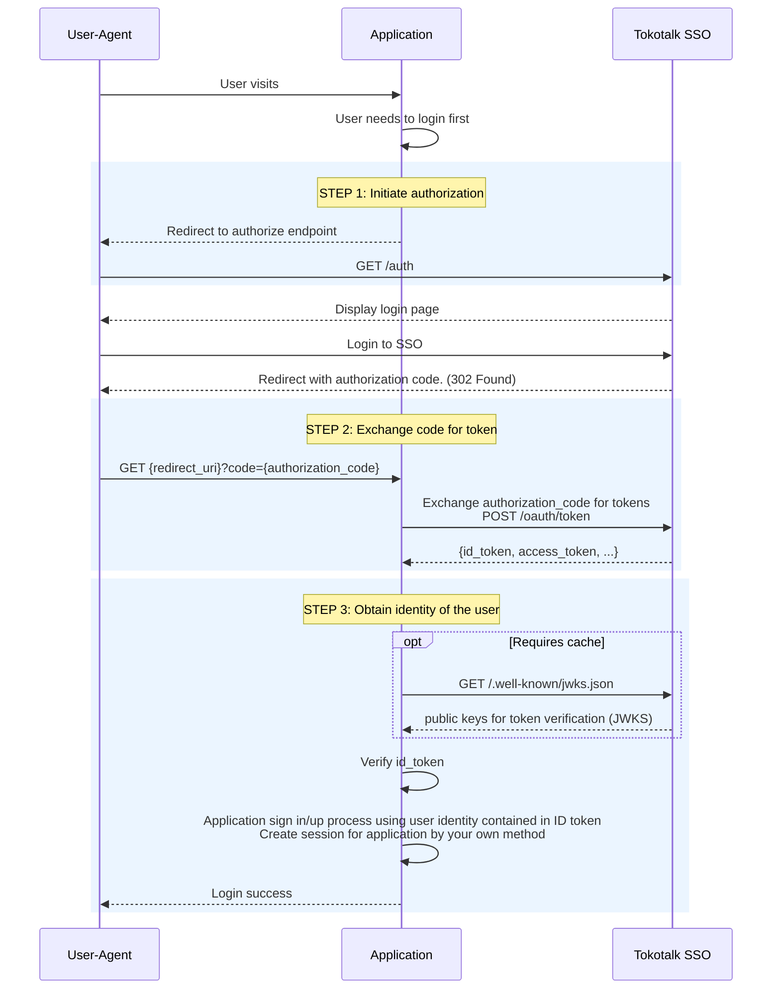

# Authenticating the user with Tokotalk Single Sign-On

This guide describes how to integrate Tokotalk Single Sign-On into your application. Tokotalk Single Sign-On service conforms [OpenID Connect](https://openid.net/connect/) specification and operates as OAuth 2.0 authorization server. External documents explaning OAuth 2.0 can be used as supplementary material but this document is prior to others.

## Overview

The diagram shows API flow for the user to login to your application using Tokotalk SSO.

1. A user visits your application and needs authentication (a new user or login session is expired)
2. Your application initiates authentication by redirecting the user to Tokotalk SSO page.
3. The user logs in to SSO and is redirected back to your application with `authorization_code`.
4. Your application exchanges `authorization_code` to `ID Token` which contains user's identity information.
5. Your application validates `ID Token` and obtains user's identity information from it.
6. Your application creates session to complete login process or creates a new account for the user



(OAuth 2.0 is originally designed as authorization framework and OpenID Connect is built on top of OAuth 2.0. We will use it for `Authentication`)

## STEP 1: Initiate authorization

When the user visits your application and needs to login, the first step to do is requesting authentication by redirecting the user to `/auth` endpoint. As a result, the user is redirected back to the location where you specified with `redirect_uri` parameter with `authorization_code`.

### 1-1. Create an anti-forgery state token

Create a unique session token which holds state between your application and the user to protect your request from cross-site request forgery ([CSRF](https://en.wikipedia.org/wiki/Cross-site_request_forgery)). A random generated string or hash from your internal state is a good option for it. Store the state token in your backend service to check it later. Pass this state token as `state` parameter of `/auth` request in the next step.

You can omit this step for your first implementation, but it is recommended to use `state` parameter for security.

### 1-2. Redirect user to /auth endpoint

Redirect the user to `/auth` endpoint with below parameters.
If the user is not logged in to SSO, the login page is presented. After logged in, the user is redirected to `redirect_uri` with `authorization_code`.  
If the user has already logged in to SSO, the user is redirected back without seeing any screen. (`Consent` screen of conventional OAuth flow could be implemented for later use case, but it doesn't exist for now)

```text
GET /auth?response_type=code&client_id={CLIENT_ID}&redirect_uri={REDIRECT_URI}&scope=openid+profile&state={STATE}
Host: auth.eks.codebrick.io
```

Parameters
| Name          | Description                                                                           | Required |
|---------------|---------------------------------------------------------------------------------------|----------|
| response_type | Use `code`. (authorization grant flow)                                            | Required |
| client_id     | Your application's client ID.                                                         | Required |
| redirect_uri  | Your application's callback URI where the authorization response is sent back.        | Required |
| scope         | Use `openid profile`. (space delimited strings of authorization scope)                | Required |
| state         | anti-foregery state token. This is optional, but strongly recommended for security.   | Optional |

This is an example of authentication request. Copy and paste it into your browser, then you'll see the login page.

```text
https://auth.eks.codebrick.io/auth?
  response_type=code&
  client_id=client.ZTM3YWVlZDViYWViZDE5MG&
  redirect_uri=https://your-app.example.com/auth_callback&
  scope=openid+profile&
  state=NWE1OWY5NzJhODNjMjQ3Nz
```

## STEP 2: Exchange authorization_code

If STEP 1 was successful, the user is redirected to the location where you specified as `redirect_uri` paramemter in STEP 1-2 with query parameters `authorization_code` and `state`.

```text
https://your-app.example.com/auth_callback?code=OTUzZDg4Mjg3MWZkMzkxMj&state=NWE1OWY5NzJhODNjMjQ3Nz
```

`authorization_code` is an one-time used code to be exchanged for tokens. The next step is to exchange `authorization_code` (or briefly `code`) to tokens.

### 2-1. Confirm anti-forgery state token

You should confirm `state` query parameter by comparing it with the value which you stored in your backend in STEP 1-1.

### 2-2. Exchange code for access_token and ID token

The next step is exchanging `authorization_code` to `access_token`, `refresh_token` and `id_token`.
Your application server exchanges them by sending POST request to token endpoint.
Remember that `code` is supposed to be used one-time only. Repeated exchange request with same `code` will fail.

The exchange request must contain `CLIENT_ID` and `CLIENT_SECRET` in [Basic auth header](https://en.wikipedia.org/wiki/Basic_access_authentication).
(Authorization: Basic `<credentials>`, where credentials is base64 encoding of 'CLIENT_ID' + ':' + 'CLIENT_SECRET')

```text
POST /oauth/token
Host: auth.eks.codebrick.io
Content-Type: application/x-www-form-urlencoded
Authorization: Basic {Base64(CLIENT_ID:CLIENT_SECRET)}

grant_type=authorization_code&code={CODE}&redirect_uri={REDIRECT_URI}
```

Parameters
| Name          | Description                                                                                                        |
|---------------|--------------------------------------------------------------------------------------------------------------------|
| grant_type    | `authorization_code`                                                                                               |
| code          | The authorization code that was returned to `redirect_uri` as query parameter `code`.                              |
| redirect_uri  | redirect_uri of initial request (STEP-1). This is used only for confirmation. Token exchange request won't call it |

A successful response contains following fields as JSON object.

Response
| Name          | Description                                                                                                   |
|---------------|---------------------------------------------------------------------------------------------------------------|
| id_token      | A [JWT](https://tools.ietf.org/html/rfc7519) that contains user's identity information.                       |
| access_token  | A token can be used to access othe resource server.                                                           |
| expires_in    | The remaining life time of access token.                                                                      |
| refresh_token | A token to renew access_token.                                                                                |
| scope         | The scope of access_token.                                                                                    |
| token_type    | `Bearer`                                                                                                      |

## STEP 3: Obtain identity of the user

An `ID token` which is retrieved in previous step is a [JWT](https://tools.ietf.org/html/rfc7519)(JSON Web Token). A JWT is simply base64 encoded JSON object signed by cryptographical algorithms. You should validate JWT to confirm that it is signed by a valid issuer. `ID Token` contains user's identity information and your application completes login process using that information.

### 3-1 Fetch public keys

Tokotalk SSO service provides public keys to validate JWT as [JWKS](https://datatracker.ietf.org/doc/html/rfc7517)(JSON Web Keys) format on public well-known folder. Public keys can be changed periodically as security practice but it won't be frequent, so you can cache them to avoid repeated round trip of requests. Do not repeat it for every request. You can manually cache them or use libraries implements in-memory caches for JWKS.

```text
GET /.well-known/jwks.json
Host: auth.eks.codebrick.io
```

### 3-2 Validate ID token

It is critical to validate JWT before using it. By validation, you can confirm it was issued by a valid issuer, which is Tokotalk SSO in this case. Validation is a process of comparing crytographic signature and supported by mutliple libraries for the most of programming languages. [jwt.io/libraries](https://jwt.io/libraries)

This is an example of parsed ID token payload.

```json
{
    "iss":"https://accounts.eks.codebrick.io",
    "sub":"83169e34-d306-462b-85d2-7f165935e893",
    "aud":"client-1",
    "exp":"1653314314",
    "iat":"1653314014",
    "email":"user@tokotalk.com",
    "name":"name of user"
}
```

Some fields must be verified. (Libraries usually provide arguments to check them)
| Field | Description                                                       | Need to verify    |
|-------|-------------------------------------------------------------------|-------------------|
| iss   | Issuer of token. This must be `https://accounts.eks.codebrick.io` | **YES**           |
| aud   | Audience of token. This must be your `CLIENT ID`.                 | **YES**           |
| sub   | **Subject. This is the user's SSO ID.**                           |                   |
| exp   | Expiry time. It must be after current date.                       | **YES**           |
| iat   | Issued time of token.                                             |                   |
| email | Email address of the user.                                        |                   |
| name  | Name of the user.                                                 |                   |

### 3-3 Create session for your application

Proceed to sign in/up process using user information obtained from `ID token`. This part is up to your application.

## Logout

To logout the user from SSO, redirect the user to `/signout` endpoint.

```text
GET /signout?redirect_uri=https://www.example.com

HTTP/1.1 302 Found
Location: https://www.example.com
```

Parameters
| Name          | Description                                                               |
|---------------|---------------------------------------------------------------------------|
| redirect_uri  | The user is redirected back to this location after signing out from SSO   |

## Example Application

[example-app](./example-app/) is a simple node.js application to demonstrate how to integrate SSO into your application. Take a look for quick understanding.
